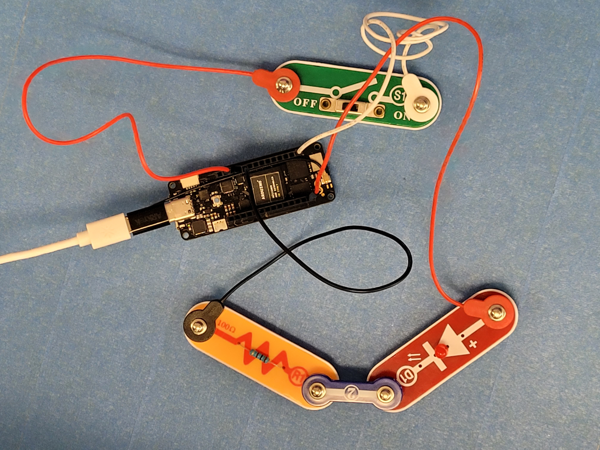
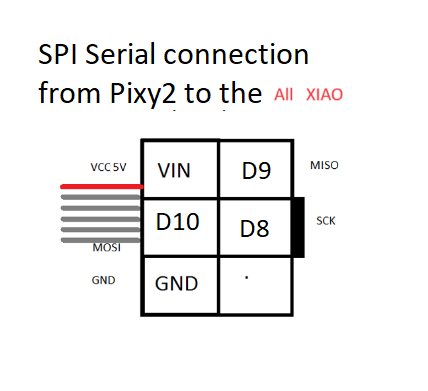
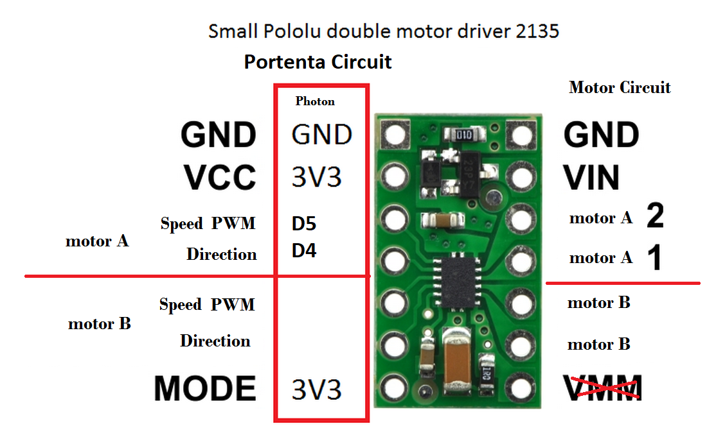
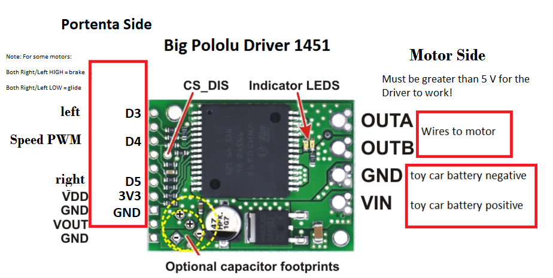
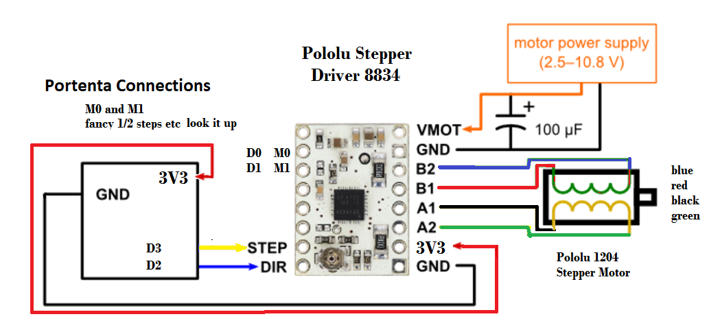
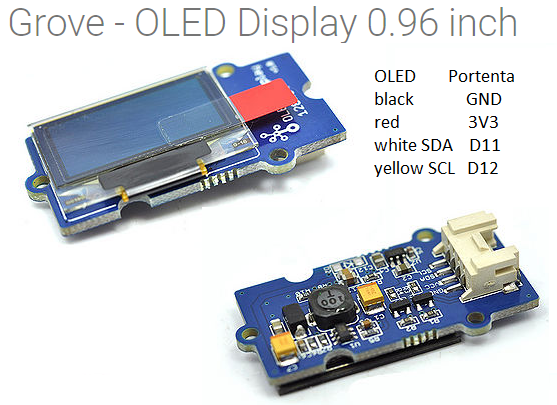

## Maker100-xiaoML-kit Robotics, IoT and TinyML Machine Learning course is ready!

## 2026 Version


## [XIAOML-Kit youtube playlist](https://www.youtube.com/watch?v=EvNXQ0sk5Ec&list=PL57Dnr1H_egtkBZJku20Bo2zaR8KUJGpa&index=1&pp=gAQBiAQB)

## [2026 Price List](https://hpssjellis.github.io/maker100-xiaoML-kit/price-2026-00.html)

This course is all about the Seeedstudio  
$38.90 USD [The-XIAOML-Kit.html which has the $22 dollar kit with a $16.90  sdCard + Cables kit,  
  
](https://www.seeedstudio.com/The-XIAOML-Kit.html)

For which the main Getting Started page is at [xiao_esp32s3_getting_started](https://wiki.seeedstudio.com/xiao_esp32s3_getting_started/)  
Any specialty code for this specific ML kit will be here on this page or at the Harvard [mlsysbook.ai]([https://mlsysbook.ai/](https://mlsysbook.ai/contents/labs/seeed/xiao_esp32s3/xiao_esp32s3.html)) free online book labs section.

# General

The currciulum for this course is at [maker100-curriculum](https://github.com/hpssjellis/maker100-curriculum)

The old version of this course  Seeedstudio [maker100-eco](https://github.com/hpssjellis/maker100-eco)

An economical version of my successful Arduino PortentaH7 [Maker100](https://github.com/hpssjellis/maker100) Robotics, IoT and TinyML Machine Learning in-person course this time using less expensive hardware such as the [$13.99 USD Seeedstudio XiaoEsp32s3](https://wiki.seeedstudio.com/xiao_esp32s3_getting_started/) for the course basics and some [EdgeImpulse.com](https://edgeimpulse.com/) cell phone assisted machine learning. 


Views better using the README.md [here](README.md)

This is not an online course, it is expected to be taught by a teacher or professor. Some students might be able to  do the course on their own, but many components of learning opportunities may be missed.

Price list for the equipment I will be using in 2026 [price-2026-00.html](price-2026-00.html) (Many other devices could be used but the videos then will not be accurate for those devices)

Note: April 2026 new Technique [webmcu-ai](https://github.com/webmcu-ai) demo page at [https://webmcu-ai.github.io/webmcu-vision-web/index.html](https://webmcu-ai.github.io/webmcu-vision-web/index.html)


**Teacher Extras:** [See Appendix A](#appendix-a-teacher-extras---why-not-use-the-xiao-expansion-board-and-round-display)


---

**Teacher Tips:** [See Appendix B](#appendix-b-teacher-tips---teaching-guidelines-and-best-practices)

---

**Why Maker100-xiaoML-kit?** [See Appendix C](#appendix-c-why-maker100-xiaoml-kit)

---

**How much cheaper is the XIAOML kit version?** [See Appendix D](#appendix-d-price-comparison---how-much-cheaper-is-the-xiaoml-kit-version)

---

**Useful Links:** [See Appendix E](#appendix-e-useful-links)


---

## Seeedstudio XIAO-ML Kit (Xiao-Esp32s3 with IMU and OLED module) Currciulum


For Arduino IDE install the expressiff ESP32 board. When loading that board look for the XIAO ESP32S3. 

Note: The Port is often named for the wrong ESP32 and that is OK.  


Video showing how to setup the XiaoEsp32s3. There are also lots of other instructions online to help with setup.


------------------------------------------------------------------------------------------------------------

## Assignments done in order for of our class of 2026, not the [Maker100 curriculum order](https://github.com/hpssjellis/maker100-curriculum).

# Steps:

1. look at the github code and hand write a short pseudocode explanation (New 2026 to combat going to an LLM first instead of looking at the code)
2. For many assignments first compile and upload the C++/C code (Arduino Sketch)
3. Unplug your device.
4. Then have a classmate or teacher check your hand drawn named circuit diagram before connecting any wires.
5. When Diagram OK, wire up the device and have it checked again before connecting ANY power (Battery and or USB-C power)
6. Check serial monitor if applicable
7. Make a very short video that shows, your names(s), circuit diagram, the board, serial monitor as proof of it working. 

-------------------------------------------------------------------------------------------------------------


<br><br><br>
# In-Person Course overview using the XiaoEsp32s3-sense  
Students are encouraged to work ahead of the class as we don't expect to have class sets of all the sensors.  

Note: You will need a USB-C cable a computer or laptop to run the code and sometimes a micro SD card.  
Also a cell phone or webCam to video the assignment when it is finished.

| Topic | Example Code| Video | Instructions and Prompt|
|:---|:---|:---|:---|
| <a name="a01-ml16" href="README.md#a01-ml16">`a01-ml16-on-device-machine-learning`</a>  Platformio and Arduino IDE on-devise-ml with u8g2 oled include library  | Great hard first day: [esp-all-menu-A0-image-train-infer.txt](https://github.com/hpssjellis/my-examples-of-tensorflowjs-for-tinytorch/blob/main/esp-on-device-train-one-program/esp-all-menu-A0-image-train-infer.txt), or try the easier first day which is the same as assignment a03-base06 but on both platformIO and the Arduino IDE  [seeed-blink-serial.ino](seeed-sketches/seeed-blink-serial.ino) | This assignment covers the [Maker100-Curriculum Basics](https://github.com/hpssjellis/maker100-curriculum#basics) Base01-base05, base07 Assignments   |   See [Tutorial ml16](#tutorial-ml16)  |
| <a name="a02-ml01" href="README.md#a02-ml01">`a02-ml01 Seeed ML SenseCraft`</a>  Follow the Sensecraft Vision example  |  [wiki.seeedstudio.com/sscma/](https://wiki.seeedstudio.com/sscma/) direct webpage [https://sensecraft.seeed.cc/ai/#/home](https://sensecraft.seeed.cc/ai/#/home)  | This assignment covers the start of the [Maker100-curriculum Machine Learning](https://github.com/hpssjellis/maker100-curriculum#machine-learning)  |      |
|   <a name="a03-base06" href="README.md#a03-base06">`a03-base06-blink-serial-print`</a>  Xiao Esp32s3 LED Blink and Serial Print on both PlatformIO and the Arduino IDE. | [seeed-blink-serial.ino](seeed-sketches/seeed-blink-serial.ino) |  <br> [wokwi Serial](https://wokwi.com/projects/454549337599230977) <br>               |  THIS IS THE CODE THAT YOU SHOULD COMPILE ONTO YOUR xiao AFTER DOING EVERY ASSIGNMENT TO CLEAR YOUR WORK!       Print other things and change the pattern of blinking delay times. This is the code you should always leave on the XIAO ML Kit so that you know it works when you first get it.  |
|   <a name="a04-base08" href="README.md#a04-base08">`a04-base08-serial-putty`</a> Serial-putty or Linux "screen"         | This is a program to load on your computer that replaces the arduino serial monitor           |   If no access to powershell or the DOS prompt, load the arduino IDE to find out the port # COM3 COM7 etc. Then CLOSE the Arduino IDE and load putty. (Set to serial and baud rate 115200)   |      Fairly easy once putty is installed. Load power shell and type mode with your Portenta programmed with a serial monitor program find the port. Then switch to Serial on Putty and Correct the COM port. Open and see if you can see serial output from the Esp32s3        |
|   <a name="a05-code10" href="README.md#a05-code10">`a05-code10-SOS`</a>  Flash SOS                           |     [dot71-sos](https://github.com/hpssjellis/portenta-pro-community-solutions/blob/main/examples/dot7-coding-curriculum/dot71-sos/dot71-sos.ino)                                                                                                                                                                         |                   | This is your first Code example from the [Maker100-Curriculum on Coding](https://github.com/hpssjellis/maker100-curriculum#coding)                   Get the code running to flash the LED_BUILTIN, then have it flash an SOS. 3 short flashes, 3 long flashes, 3 short flashes then a 5 second rest.     |
|  <a name="a06-sense04" href="README.md#a06-sense04">`a06-Sense04-button`</a>.  Button causes LED to blink          |       [seeed-led-button.ino](seeed-sketches/seeed-led-button.ino) | This is actually an example of an absolute basic final project since it has a sensor (The Button), the micrcontroller (XIAO esp32S3) and an actuator (The LED). This is your first [maker100-curriculum sensor](https://github.com/hpssjellis/maker100-curriculum#sensors) assignment                  |                     <br>        Control the LED with the button, then control multiple LED's with Multiple Buttons. Note: Can't control large current flow devices, WHY? Could you make the external LED interact like the internal LED?  Did you realise that this is actaully a sensor and actuator assignment?  |
|  <a name="a07-act01" href="README.md#a07-act01">`a07-act01-servo`</a> Servo                           |      [seeed-servo-needs-ESP32Servo-include.ino](seeed-sketches/seeed-servo-needs-ESP32Servo-include.ino)       | This is your first [Maker100-Curiculum Actuator](https://github.com/hpssjellis/maker100-curriculum?tab=readme-ov-file#actuators-motors-leds-etc) Assignment.                  |                 MUST HAVE AN EXTERNAL BATTERY TO RUN THE 6 VOLT SERVO! Need the negative GND from the external battery to run to both the XIAO and the servo. Also you need to find the library and include it  ```#include <ESP32Servo.h>```  I have the Pololu Servo Product number 1057, Power HD High-Torque Servo 1501MG [here](https://www.pololu.com/product/1057).  <br> To connect XIAO D5 (orange wire) GND (brown wire) to the servo, <br> 6 volt battery positive (red) and Negative (brown) to servo. Note: The pololu servo's tend to jitter. A 470 uF capacitor as close to the servo as possible really helps. so the red pos to the pos of a capacitor and the brown negative to the negative then the wires to the positive battery and the negative to the XIAO and Battery negative.   |
|  <a name="a08-webAI06" href="README.md#a08-webAI06">`a08-webAI06-Hand Pose`</a> HandPose            |   Make a video of this webpage working [handpose](https://hpssjellis.github.io/beginner-tensorflowjs-examples-in-javascript/tfjs-models/handpose/index.html)           | This is your first [Maker100- Curriculum-WebAI](https://github.com/hpssjellis/maker100-curriculum?tab=readme-ov-file#webai-edgeai) assignment working presently only on your cell phone or desktop/laptop computer, eventually TinyML will be powerrful enough to run this code. Note: Several Raspberry Pis and the Arduino UnoQ can already run this code out of a web browser on the Linux tiny device.   |       |
|  <a name="a09-iot02" href="README.md#a09-iot02">`a09-iot02-Camera-web-server`</a> Camera web server | Arduino IDE Examples --> ESP32-->camera-->CameraWebServer example  you will have to make some settings about the type of ESP32 in the code. Also it is so fast you may want a delay(3000); to slow it down at the start. You can also use the class of 2025 Riley's simplified [./seeed-sketches/a48-camera-streaming.ino](./seeed-sketches/a48-camera-streaming.ino)           |   Make a video of the default ESP32S3 Camera streaming webserver. You can use the class hotspot or your own cell phone hotspot and enter the SSID and password. Ask the teacher to put those on the board.           | This is your first [Maker100- Curriculum-IoT](https://github.com/hpssjellis/maker100-curriculum/blob/main/README.md#iot-internet-of-things-connectivity) assignment which needs to have some kind of communication between devices.   |       
| <a name="a10-ml02" href="README.md#a10-ml02">`a10-ml02 EdgeImpulse Vision Model`</a>  Follow the EdgeImpulse Vision Classification Machine Learning model   | You make the code and download it as an Arduino Library from Edge Impulse |  [https://edgeimpulse.com/](https://edgeimpulse.com/)     This is a full playlist so many other videos here might help                |      This website is a good starting point [https://hpssjellis.github.io/multi-language-edgeimpulse-tutorial-vision-cell-phone/](https://hpssjellis.github.io/multi-language-edgeimpulse-tutorial-vision-cell-phone/). For this assignment we are not using the microcontroller.    [See Appendix F - EdgeImpulse Instructions and Prompt](#appendix-f) |
|  <a name="a11-code01-09" href="README.md#a11-code01-09">`a11-code01-09 VIDEO FLAC`</a> All Code (VIDEO FLAC) Assignments           |   Install the Arduino library ([Portenta Pro Community Solutions](https://github.com/hpssjellis/portenta-pro-community-solutions/tree/main/examples/dot7-coding-curriculum)) and load, change and video all Coding assignments dot72-dot79 You can copy them directly from the github, or from the examples in the library.  Mainy of the course assignments are in that library          | VIDEO FLAC is basic coding skills: Variables, Input output, Decisions, Events, Objects(Structs), Functions, Loops, Arrays, Classes(Properties and Methods)    |  One of the few assignments that might need it's own folder, but the video gets copied into the main folder. Slightly change each program. 9 programs one grade.    |
|  <a name="a12-webAI01-11" href="README.md#a12-webAI01-11">`a12-webAI01-11`</a> All Code WebAI Assignments        |   Prove you can get most of these working  the location with links is on the [Maker100-curriculum-webAI](https://github.com/hpssjellis/maker100-curriculum/blob/main/README.md#webai-edgeai) page         | Copy the examples and get the webpages working  |  One of the few assignments that might need it's own folder, but the video gets copied into the main folder. Slightly change each program. 10 programs one grade. We have already done the hand pose   |


.

<br><br><br>
# In-Person Course on the XIAOML kit which is just the XIAO esp32s3 with an OLED and a motion IMU (x,y,z acceleration)

| Topic | Example Code| Video | Instructions and Prompt|
|:---|:---|:---|:---|
|  <a name="a13-OLED-hello" href="README.md#a13-OLED-hello">`a13-OLED-hello`</a>        |   The blink-serial-program for the XIAO ML Kit, says hello on the OLED  [xiaoML-kit/xiaoML-good-serial-blink-oled-digital-read.ino](https://github.com/hpssjellis/maker100-xiaoML-kit/blob/main/xiaoML-kit/xiaoML-good-serial-blink-oled-digital-read.ino)   |   If you have the XIAO ML Kit this is the best program to leave on the device after your have done your assignments. Then just plug it into power and you can see that the board works.    |  Careful with the OLED if you bend it too often the connection weakens  |
|  <a name="a14-IMU-Motion" href="README.mda14-IMU-Motion">`a14-IMU-Motion`</a>        |  Basic x, y, z motion with the XIAO ML Kit [xiaoML-kit/xiaoML-6dof-imu-basics.ino](https://github.com/hpssjellis/maker100-xiaoML-kit/blob/main/xiaoML-kit/xiaoML-6dof-imu-basics.ino)   |  This would be a goo da ssignment to try to put the results onto the OLED. Presently only showing on the serial monitor.    |   |
| No grade, try this with your XIAO ML kit to test everything    | [https://hpssjellis.github.io/xiaoml-kit-esp32-web-tool/public/index.html](https://hpssjellis.github.io/xiaoml-kit-esp32-web-tool/public/index.html)  | It flashes an exported binary to your device then reads the camera, mic and IMU all live.  |  Can also see and change the SD card. Use this to test if your esp32s3 is working, your camera and mic module, the IMU and OLED and also the sd card. Great testing code. |
| webSerial-Tracer   | [https://hpssjellis.github.io/xiaoml-kit-webserial-variable-trace/webtracer.html](https://hpssjellis.github.io/xiaoml-kit-webserial-variable-trace/webtracer.html) Use this webpage and the github link [https://github.com/hpssjellis/xiaoml-kit-webserial-variable-trace](https://github.com/hpssjellis/xiaoml-kit-webserial-variable-trace) to load the latest webserial-tracer code also generate the .elf file from the arduino IDE export binary.  | Then have a fancy data plotter and peak and set memory items. |  Careful setting memory as you could brick your MCU.  |
.


.


.


.


.


.


<br><br><br>
# In-Person Course on Sensors using the XiaoEsp32s3-sense
Students are encouraged to work ahead of the class.

| Topic | Example Code| Video | Instructions and Prompt|
|:---|:---|:---|:---|
|  <a name="a15" href="README.md#a15">`a15-voltage-divider`</a> Analog Read (Voltage divider for various 2 prong sensors (variable resistors: flex sensor, photoresistor, touch/pressure sensor))                |  [dot211-any-variable-resistor-sensor.ino](https://github.com/hpssjellis/portenta-pro-community-solutions/blob/main/examples/dot2-portenta-h7-with-accessories/dot21-sensors/dot211-any-variable-resistor-sensor/dot211-any-variable-resistor-sensor.ino)    |       [](https://www.youtube.com/watch?v=wA6JB-PzuUs&list=PL57Dnr1H_egt9XmHjfcyRR4YCo3eGrZwQ&index=3&pp=gAQBiAQB)        [](https://www.youtube.com/watch?v=GR3D8C6dOl8&list=PL57Dnr1H_egv1FVzAcCZVeANJMs3Hta05&index=3)            |                 Change the Resistor amount and which resistor is attached to 3V3 to get the largest most sensible range of readings.     |
|   <a name="a16" href="README.md#a16">`a16-two-wire`</a>  Another two wire sensor  |      |     | Figure out how to read the sensor from another variable resistor sensor like a flex sensor, photo-resistor, pressure sensor etc.  |
|  <a name="a17" href="README.md#a17">`a17-joystick`</a>  Game Controller/JoyStick   |      |     | Figure out how to use the 3 wires (3V3, GND, A0) for one dimension of a joystick  |
|  <a name="a18" href="README.md#a18">`a18-rangefinder`</a> Rangefinder (WAIT UNTIL VOLTAGE DIVIDER IS TESTED)   Watch this video first [https://youtu.be/SIc6zj06bhQ?si=m28UJreFCBhAaYBn&t=193](https://youtu.be/SIc6zj06bhQ?si=m28UJreFCBhAaYBn&t=193)    Then load this [wokwi-rangefinder](https://wokwi.com/projects/455728225241458689)                  |      [dot214-RangeFinder.ino](https://github.com/hpssjellis/portenta-pro-community-solutions/blob/main/examples/dot2-portenta-h7-with-accessories/dot21-sensors/dot214-RangeFinder/dot214-RangeFinder.ino)     | <br>     [](https://www.youtube.com/watch?v=TwHTtcjS2T8&list=PL57Dnr1H_egt9XmHjfcyRR4YCo3eGrZwQ&index=13&pp=iAQB)    [](https://www.youtube.com/watch?v=E1B_iE171E8&list=PL57Dnr1H_egv1FVzAcCZVeANJMs3Hta05&index=13) |  For this assignment a variable in the code can be changed to make the range finder work at a greater distance.  |
|  <a name="a19" href="README.md#a19">`a19-image-to-sd-card`</a> XiaoEsp32s3 Image to SD Card             | A great bit of code to run is [seeed-cam-to-sd-card.ino](seeed-sketches/seeed-cam-to-sd-card.ino) which allows pictures in JPG format to be loaded onto the SD card based on a user set delay.   |   |      You will need a micro SD card.        |
|   <a name="a20" href="README.md#a20">`a20video-to-sd-card`</a> XiaoEsp32s3 Video to SD Card             | [seeed-video-to-sd-card.ino](seeed-sketches/seeed-video-to-sd-card.ino) which allows video in MPEG format to be loaded onto the SD card based on a user set delay.   |   |      You will need a micro SD card.        |
|  <a name="a21" href="README.md#a21">`a21-sound-to-sd-card`</a> XiaoEsp32s3 Sound to SD Card                          |  [a02-sound-to-sd-card.ino](seeed-sketches/a02-sound-to-sd-card.ino) Needs the latest board version presently 3.2.0 but later should also work.   Fixed by @packetbytebuf. works now. Read the first few lines.     |               |                             |
|  <a name="a22" href="README.md#a22">`a22-pixy2`</a>  Serial SPI Pixy2                          |           [dot212-pixy2-SPI.ino](https://github.com/hpssjellis/portenta-pro-community-solutions/blob/main/examples/dot2-portenta-h7-with-accessories/dot21-sensors/dot212-pixy2-SPI/dot212-pixy2-SPI.ino)  Note: Dot212 Pixy example using the Portenta pro community solutions library will be pre-setup with the pixy include files!    |   [](https://www.youtube.com/watch?v=Op5XIiGr0Q0&list=PL57Dnr1H_egt9XmHjfcyRR4YCo3eGrZwQ&index=8&pp=iAQB)      [](https://www.youtube.com/watch?v=p8KmFFqqU6U&list=PL57Dnr1H_egv1FVzAcCZVeANJMs3Hta05&index=14)              |                      <br>    The Pixy2 is so cool students will have no problem coming up with things to detect. The Pixy2 is really good for a final project since students just need to connect an actuator. Example: when you see the "orange" cat have a servo open a lever to feed it.    
|  <a name="a23" href="README.md#a23">`a23-webmcu-AI`</a>  on-device training with webpage support and flashing  |  Try the webpage [here](https://webmcu-ai.github.io/webmcu-vision-web/index.html) with a fully setup [xioa ML kit](https://www.seeedstudio.com/The-XIAOML-Kit.html), actually works with just the xiao esp32s3 and the serial monitor, but the OLED of the xiao ml kit is a kind of nice feature. | Watch the video and the webpage may have changed slightly, but you can do all the image collection, training and inference on the webpage and then transfer to the device either manually using the sd card, or by clicking buttons.    [](https://youtu.be/WydSCn5kIFM?si=XoQ2vJx4zognouky)     | ...  |
|   <a name="a24" href="README.md#a24">`a24-gps`</a> GPS                           |         [./xiaoML-kit/air530-gps04.txt](./xiaoML-kit/air530-gps04.txt)       |          New code works great, would be interesting to connect the Grove OLED so you can see the Lat and Long values.     |   Plug the lat and long vaules into google maps and find out where you are.               |
|   <a name="a25" href="README.md#a25">`a25-fomo-with-gray-oled`</a> Edge-Impulse-Vision-FOMO with Grayscale OLED                         |      Use the Vision grayscale OLED from above and the New Code [seeed-camera-96x96-to-waveshare-grayscale-oled.ino](https://github.com/hpssjellis/maker100-eco/blob/main/seeed-sketches/seeed-camera-96x96-to-waveshare-grayscale-oled.ino) Note: Just like using the edgeimpulse FOMO library this code also needs the arudino IDE esp32 board version reduced to version 2.0.17, since all version 3.x has a breaking change. This might be better code to try [https://github.com/hpssjellis/maker100-xiaoML-kit/blob/main/seeed-sketches/a21b-SLOW-edgeimpulse-fomo-96x96-gray.ino](https://github.com/hpssjellis/maker100-xiaoML-kit/blob/main/seeed-sketches/a21b-SLOW-edgeimpulse-fomo-96x96-gray.ino) Get used to this it is called DEPRECATION and it is very stressful for anyone involved in any type of coding and can happen at any time. Code that worked yesterday does not work today. What is the breaking change. In this case it was esp32 verison 3.x|    [](https://www.youtube.com/watch?v=weNVGGaQO50&list=PL57Dnr1H_egt9XmHjfcyRR4YCo3eGrZwQ&index=2&pp=iAQB)       Note: Use the code given. Then just change the default FOMO include file name to the deployed Edgeimpulse include file name.   |   Like the original classification model, just now with bounding boxes and you label each object to detect  |


<br><br><br>
# In-Person Course on Actuators using the XiaoEsp32s3-sense
Students are encouraged to work ahead of the class.

| Topic | Example Code| Video | Instructions and Prompt|
|:---|:---|:---|:---|
|   <a name="a26" href="README.md#a26">`a26-pnp`</a> PNP Transistor                        |      [dot224-pwm-transistor.ino](https://github.com/hpssjellis/portenta-pro-community-solutions/blob/main/examples/dot2-portenta-h7-with-accessories/dot22-actuators/dot224-pwm-transistor/dot224-pwm-transistor.ino)          |         [](https://www.youtube.com/watch?v=XqxTnUFlMnY&list=PL57Dnr1H_egv1FVzAcCZVeANJMs3Hta05&index=17)    |      <br>                         Make either PNP transistor with a small motor. |
|  <a name="a27" href="README.md#a27">`a27-npn`</a> NPN Transistor                        |      [dot224-pwm-transistor.ino](https://github.com/hpssjellis/portenta-pro-community-solutions/blob/main/examples/dot2-portenta-h7-with-accessories/dot22-actuators/dot224-pwm-transistor/dot224-pwm-transistor.ino)          |         [](https://www.youtube.com/watch?v=XqxTnUFlMnY&list=PL57Dnr1H_egv1FVzAcCZVeANJMs3Hta05&index=17)    |         <br>                        Make an NPN transistor with a small motor |
|  <a name="a28" href="README.md#a28">`a28-small-dc-motor`</a> Small Dual DC Motor Driver                            |       [dot226-small-dual-dc-motor-driver.ino](https://github.com/hpssjellis/portenta-pro-community-solutions/blob/main/examples/dot2-portenta-h7-with-accessories/dot22-actuators/dot226-small-dual-dc-motor-driver/dot226-small-dual-dc-motor-driver.ino)  |  [](https://www.youtube.com/watch?v=dQZzMBJbSXk&list=PL57Dnr1H_egt9XmHjfcyRR4YCo3eGrZwQ&index=15&pp=iAQB)     [](https://www.youtube.com/watch?v=lUE-hmAddhY&list=PL57Dnr1H_egv1FVzAcCZVeANJMs3Hta05&index=5)     |          <br>  Get a small motor working using it's own power supply and change the code so it does what you want. Pololu #2135 DRV8835 Dual Motor Driver Carrier  [here](https://www.pololu.com/product/2135)     |
|   <a name="a29" href="README.md#a29">`a29-large-dc-motor`</a> Large DC Motor Driver                          |  Not-working -->   [dot227-big-dc-motor-driver.ino](https://github.com/hpssjellis/portenta-pro-community-solutions/blob/main/examples/dot2-portenta-h7-with-accessories/dot22-actuators/dot227-big-dc-motor-driver/dot227-big-dc-motor-driver.ino)   ,  Working checked by Seth and Jade [seeed-sketches/a35-new-big-motor.ino ](seeed-sketches/a35-new-big-motor.ino )        |  [](https://www.youtube.com/watch?v=hE4dZ66sOWw&list=PL57Dnr1H_egt9XmHjfcyRR4YCo3eGrZwQ&index=16&pp=iAQB)       [](https://www.youtube.com/watch?v=YcRQSFhr8MY&list=PL57Dnr1H_egv1FVzAcCZVeANJMs3Hta05&index=7)         |                     <br>     Get a 6V motor running and change code for it to do what you want. Protect the Phton from the 6 Volt motor side. Check Pololu 1451 VNH5019 Motor Driver Carrier [here](https://www.pololu.com/product/1451)     |
|   <a name="a30" href="README.md#a30">`a30-stepper-motor`</a> Stepper Motor                         |           [dot225-stepper-motor.ino](https://github.com/hpssjellis/portenta-pro-community-solutions/blob/main/examples/dot2-portenta-h7-with-accessories/dot22-actuators/dot225-stepper-motor/dot225-stepper-motor.ino)      |      [](https://www.youtube.com/watch?v=Fru6QtzLnrI&list=PL57Dnr1H_egv1FVzAcCZVeANJMs3Hta05&index=4)            |                          <br>     Note: This stepper needs 6V, Change code to do what you want.  Pololu 2134 DRV8834 Low-Voltage Stepper Motor Driver Carrier [here](https://www.pololu.com/product/2134)   |
|  <a name="a31" href="README.md#a31">`a31-multiplexer`</a>  Multiplexer (mux) (Presently not working so make this optional)  |      |     | Connect the XIAO using I2C to a multiplexer a device that allows more pins to be used when your board runs out of pins Typically for a large project   |
|   <a name="a32" href="README.md#a32">`a32-xiao-using-I2C`</a>  Use a 2nd XIAO as an I2C multiplexer   |  Thanks Leander and Giorgio <br><br> I2C reciever:  [seeed-i2c-2xiao-receiver.ino](seeed-sketches/seeed-i2c-2xiao-receiver.ino) <br><br> I2C transmitter [seeed-i2c-2xiao-transmitter.ino](seeed-sketches/seeed-i2c-2xiao-transmitter.ino)   |     | important: on the first XIAO you must have a pullup 4.7 kOhm resistor between SDA and 3V3 and also between SCL and 3V3.  On all XIAO board I2C SDA is D4 and SCL is D5 just connect them on each board, making these connections really easy. If you want the first board to power the second board just connect GND to GND and 3V3 to 3V3. Theoretically if you need even more pins you can connect a third etc XIAO board. For an advanced ability try 2 way communication.  |
|  <a name="a33" href="README.md#a33">`a33-xiao-using-uart`</a>  Use a 2nd XIAO as a UART Serial  multiplexer   |  UART reciever:  [2xiao-uart-receive.ino](seeed-sketches/2xiao-uart-receive.ino) <br><br> UART transmitter [2xiao-uart-transmit.ino](seeed-sketches/2xiao-uart-transmit.ino)   |     | Connect the transmitter TX pin (D6) to the receiver RX pin (D7) If you want the first board to power the second board just connect GND to GND and 3V3 to 3V3. For an advanced ability try 2 way communication.  |
|  <a name="a34" href="README.md#a34">`a34-I2C-oled`</a> Serial I2C OLED                          |          [dot222-I2C-grove-OLED.ino](https://github.com/hpssjellis/portenta-pro-community-solutions/blob/main/examples/dot2-portenta-h7-with-accessories/dot22-actuators/dot222-I2C-grove-OLED/dot222-I2C-grove-OLED.ino)     |   [](https://www.youtube.com/watch?v=rzmIUCMhakk&list=PL57Dnr1H_egt9XmHjfcyRR4YCo3eGrZwQ&index=10&pp=iAQB)   [](https://www.youtube.com/watch?v=ruykYcViWo0&list=PL57Dnr1H_egv1FVzAcCZVeANJMs3Hta05&index=10)       |                       <br>     Have fun with this. Have it say what you want, where you want it and for how long.     |
|    <a name="a35" href="README.md#a35">`a35-grayscale-oled`</a> XiaoEsp32s3 waveshare-greyscale-oled                          |   [seeed-waveshare-grayscale-oled.ino](seeed-sketches/seeed-waveshare-grayscale-oled.ino)      |         [](https://www.youtube.com/watch?v=p4cxKxLqy3g&list=PL57Dnr1H_egt9XmHjfcyRR4YCo3eGrZwQ&index=11&pp=iAQB)        |   Get thee Grayscale Waveform 128x128 OLED                      |
|  <a name="a36" href="README.md#a36">`a36-cam-to-grayscale-oled`</a> XiaoEsp32s3 camera 96x96-waveshare-greyscale-oled                          |  then try with the camera [seeed-camera-grayscale-waveshare-oled.ino](seeed-sketches/seeed-camera-grayscale-waveshare-oled.ino)         |       [](https://www.youtube.com/watch?v=l0H5UnE7HRc&list=PL57Dnr1H_egt9XmHjfcyRR4YCo3eGrZwQ&index=12&pp=iAQB)          |   Get the XIAO Camera working with the Grayscale Waveform 128x128 OLED      Note: Thsi camera can do much better resolution than 96x96 but that is one of the best resolutions to do Machine Learning with.                |
|  <a name="a37" href="README.md#a37">`a37-e-ink-display`</a>  e-ink display   |  New displays with esp32s3 driver board. Getting Started [here](https://wiki.seeedstudio.com/epaper_ee04/). The Library is [here Seeed_GFX](https://github.com/Seeed-Studio/Seeed_GFX)  and configuration webpage [here](https://seeed-studio.github.io/Seeed_GFX/) helps setup a driver.h file (only one student probably has to do this).  | ... |   Once installed look in the Arduino IDE look in examples --> Seeed_GFX--> ePaper -->Basic--> HelloWorld  |
|  <a name="a38" href="README.md#a38">`a38-TFT-round-touch-screen`</a> Seeed RGB Round Touch Screen                         |        [./round-display/camera-to-round-with-touch02.txt](./round-display/camera-to-round-with-touch02.txt)       |       [](https://www.youtube.com/watch?v=SvW3U7YzV0Y&list=PL57Dnr1H_egv1FVzAcCZVeANJMs3Hta05&index=16)       |     A bit trickery to get ready.  Read the round display [README.md file](https://github.com/hpssjellis/maker100-xiaoML-kit/tree/main/round-display/README.md)    |
|   <a name="a39" href="README.md#a39">`a39-pcb-board`</a>  PCB Board Build using [easyEDA](https://easyeda.com/)                             |  Great starter tutorial to make a PCB with a battery holder, resistor and ligtht<br>   [](https://www.youtube.com/watch?v=gjPNYMRA0m8&list=PLbKMtvtYbdPMZfzGuVTdc0MWKrFvU4nsu&index=2)      ||       I have found lots of PCB design videos that are either to complex or just long and boring. The video pressented here was not made by me but is very short and many of my animation students can follow it very quickly to make their own board using easyEDA   |
|   <a name="a40" href="README.md#a40">`a40-lidar`</a>  Lidar Basics   |  [seeed-lidar-serial.ino](seeed-sketches/seeed-lidar-serial.ino)   IMPORTANT: on Lidar GND is the yellow wire! Needs 5V to run. Connect green wire to XIAO-esp32S3 RX (D7) to receive data.         |     | Try the first code to see if the lidar works over the serial monitor, then the second code:    |
|   <a name="a41" href="README.md#a41">`a41-lidar-to-grayscale-oled`</a>  Lidar with Grayscale OLED    |    [seeed-lidar-oled.ino](seeed-sketches/seeed-lidar-oled.ino)    IMPORTANT: on Lidar GND is the yellow wire! Both Lidar and OLED need 5V to run. Connect green wire to XIAO RX (D7) to receive data. Grayscale OLED connections in the code: red 5V, GND to GND, blue D10, yellow D8, green D0, orange D1.       |   | [d100 lidar datasheet](https://github.com/ldrobotSensorTeam/DeveloperKit/blob/master/D100Kit.md)     |


<br><br><br>
## IoT part of the in-person course using the XiaoEsp32s3-sense
Students are encouraged to work ahead of the class.

| Topic | Example Code| Video | Instructions |
|:---|:---|:---|:---|
|  <a name="a42" href="README.md#a42">`a42-wifi-webserver`</a>  WiFi WebServer  |  [seeed-wifi-server.ino](seeed-sketches/seeed-wifi-server.ino)    |      [](https://www.youtube.com/watch?v=oygGsGLLLGM&list=PL57Dnr1H_egv1FVzAcCZVeANJMs3Hta05&index=9)     |  You will need to setup a hotspot with a SSID and PASSWORD on a local network and then go to the url in the serial monitor on a computer or cell phone connected to the same local network  |
|   <a name="a43" href="README.md#a43">`a43-camera-streaming`</a>  Camera Streaming   |  Try this solution by Riley. Thank him in class if you like it. [seeed-sketches/a48-camera-streaming.ino](seeed-sketches/a48-camera-streaming.ino)    |     |  Load the XIAO_ESP32S3 board in the Arduino IDE, The look for the examples:  esp32 --> camera --> cameraWebServer  |
|   <a name="a44" href="README.md#a44">`a44-sound-streaming`</a>  Sound Streaming    |  [new2026/sound-wifi-stream02.txt](./new2026/sound-wifi-stream02.txt)  Use a schools hoptspot or make your own. The serial monitor shows the URL and the web browser MUST be on the same hotspot.  |  Easiest to do from your own cell phone, make the hotspot and view the webpage while the XIOA ML kit is connected to your computer. Strange but the device connects almost immediately, so if it doesn't connect probably best to power cycle it.   | Mason try this on the iPhone [./new2026/sound-wifi-stream-v04-iphone.txt](./new2026/sound-wifi-stream-v04-iphone.txt). Everyone else remember to change the hotspot SSID and password in the code. |
|   <a name="a45" href="README.md#a45">`a45-LoRa-Mestastic`</a>  Need to flash the [LoRa Meshtastic](https://flasher.meshtastic.org/) code and then install meshtastic on a cell phone  |  [Cell Phone Meshtastic app download](https://meshtastic.org/downloads/)    |  When you boot the deivce you should be able to connect over blouetooth to setup the phone app, then LoRa can be sent and received from the LoRa module. This would allow your cell phone to send LoRa text anywhere, with or without cell reception.   | Advanced, try other LoRa P2P protocols and perhaps get the OLED working also possiblity of getting the IMU working with edgeImpulse to send Motion data over LoRa.  |
|  <a name="a46" href="README.md#a46">`a46-adafruitIO`</a> Web-AdafruitIO-Connectivity                        |  MQTT-ESP32-Websocket <br> [seeed-adafruit-mqtt-g.ino](seeed-sketches/seeed-adafruit-mqtt-g.ino) <br> <br> The MQTT library to install was written by Joel Gaehwiler and is way down on the arduino library install list  <br><br>    | First  [adafruit login](https://accounts.adafruit.com/users/sign_in) <br><br> Then setup a webpage websocket to see how things work use this webpage <br> [ada-websocket02.html](https://hpssjellis.github.io/my-examples-of-iot-platforms/public/ada-websocket02.html)  <br> Use the key and username from the Adafruit "IO" site. <br><br>  Lots of information for the PortentaH7 at this website<br> <a href="https://hpssjellis.github.io/my-examples-of-iot-platforms/public/index.html">Adafruit-Connectivity</a>     | This is a good but large project. A lot for things to learn here |
|  <a name="a47" href="README.md#a47">`a47-BLE`</a>  Bluetooth Connectivity  Do this later, I have not tested it yet. |  [seeed-draft-BLE.ino](seeed-sketches/seeed-draft-BLE.ino)    |     | The ESP library should have some BLE code. You will need an App like NRF connect by nordic semiconductor to see the BLE connection    |


<br><br><br>
## Machine Learning part of the in-person course using the XiaoEsp32s3-sense
Students are encouraged to work ahead of the class.   
Note: These assignments should be done as a break from the regular course throught the course assignments. 
It is a bit to heavy to do all of these one after another.


| Topic | Example Code| Video | Instructions and Prompt |
|:---|:---|:---|:---|
|  <a name="a48" href="README.md#a48">`a48-XIAO ML Kit Motion`</a>  Load a three class motion model on the XIAO ML Kit   | New: run this code on the xiaoML kit (needs the IMU) [webmcu-ai/on-device-motion/blob/main/firmware.ino](https://github.com/webmcu-ai/on-device-motion/blob/main/firmware.ino) , follow the menu, train several times. <br> OLD:  Several steps: <br><br>1. Generate a csv file with motion data [xiaoML-kit/motion-to-sd-as-csv02.txt](./xiaoML-kit/motion-to-sd-as-csv02.txt) a trick is to power cycle the xiao between classes so each class has it's own 4 digit number for all csv files, <br><br>2. upload data for each class (0still, 2punch, 3wave) to edgeImpulse.    [edgeimpulse.com](https://studio.edgeimpulse.com/login), <br><br>3. Download the deployment include file and install on the Arduino IDE. <br<br>> 4. Load this code with your include file [xiaoML-kit/motion-edgeimpulse-xiao01.txt](./xiaoML-kit/motion-edgeimpulse-xiao01.txt)       |         This is a full playlist so many other videos here might help         Probably best to do assignment a55 first.       |  Note: here is the books view  [mlsysbook motion_classification.html](https://mlsysbook.ai/kits/contents/seeed/xiao_esp32s3/motion_classification/motion_classification.html) and Marcello's github [XIAOML_Kit_code](https://github.com/Mjrovai/XIAO-ESP32S3-Sense/tree/main/XIAOML_Kit_code)     |
|  <a name="a49" href="README.md#a49">`a49-xiao-classify`</a> Needs old 2.0.17 ESP32 Board for the Arduino IDE. See [Appendix](#appendix-f-edgeimpulse-vision-model---instructions-and-chatgpt-prompt) . Put the above classify Vision model on the XiaoEsp32s3 Using the Arduino IDE  | Needs board version 2.0.15   [seeed-edgeimpulse-vision-fomo.ino](./seeed-sketches/seeed-edgeimpulse-vision-fomo.ino)  Advanced fix the code for the latest board >= 3.2.0  |          |  Set Arduino Tools-->PSRAM-->OPI PSRAM and presently for Vision must use the OLD Arduino IDE  ~1.8.19 Note: on edge impulse turn off the EON compiler before exporting the library.  |
|   <a name="a50" href="README.md#a50">`a50-cell-FOMO`</a>  Using your cell phone to make a FOMO model   |      |     | No unknown and must choose bounding boxes. Still use grayscale and 96x96 resolution   |
|  <a name="a51" href="README.md#a51">`a51-XIAO-FOMO`</a>  Put the FOMO model onto the XiaoEsp32s3  Needs old 2.0.17 ESP32 Board for the Arduino IDE. See [Appendix](#appendix-f-edgeimpulse-vision-model---instructions-and-chatgpt-prompt) .   | Needs board version 2.0.17 WORKS ON BOTH NEW AND OLD ARDUINO IDE  [seeed-edgeimpulse-vision-fomo.ino](./seeed-sketches/seeed-edgeimpulse-vision-fomo.ino)    |       Try this code for the XIOA ml Kit [xiaoml-96x96-rgb-fomo-eyes-oled.ino](xiaoML-kit/xiaoml-96x96-rgb-fomo-eyes-oled.ino)   | Must download the deployment Arduino library from EdgeImpulse and see the example to get the include filename. then copy that include file name to the code to the left.  |
|   <a name="a52" href="README.md#a52">`a52-cell-wake-word`</a>  Use your cell phone to make a Yes, No, unknown Sound Model   |      |     |   Follow the wizard on Edgeimpulse to make a verbal Machine Learning model using your cell phone. Then download the Arduino deployment, install the zipped Arduino library and choose the default Portenta Sound example. Then talk into your Portenta and view the Serial Monitor. Then get the onboard LED to respond to your voice.            |
|   <a name="a53" href="README.md#a53">`a53-xiao-wake-word`</a>  Put the sound (wake word) model onto your XiaoEsp32s  Needs old 2.0.17 ESP32 Board for the Arduino IDE. See [Appendix](#appendix-f-edgeimpulse-vision-model---instructions-and-chatgpt-prompt) .   | As far as I can tell student Riley fixed this one as well. Can someone check it?  [seeed-edgeimpulse-sound.ino](./seeed-sketches/seeed-edgeimpulse-sound.ino)   |     | Make the normal edgeimpulse.com sound model. then deplyment -->Arduino and add the zipped library to the arduino IDER. Then view the example to get the proper include filename and use that include file name with the code provided.    |
|  <a name="a54" href="README.md#a54">`a54-cli`</a>  (optional) Try the Edgeimpulse connection method  |   [edgeimpulse.com](https://studio.edgeimpulse.com/login)      |     |    |
|   <a name="a55" href="README.md#a55">`a55-cell-motion`</a>  EdgeImpulse cell phone motion x,y,z model   |      |     | Do this for later in the course when we use the RAK2270StickerTracker to get an idea of what we are doing. If you have a motion sensor for the XiaoEsp32s3-sense then you could upload this model to it but that is optional  |
|   <a name="a56" href="README.md#a56">`a56-vision-regression`</a>  Vision regression Analysis  |   Have it work on your cell phone only. Regression means every label is an integer.   |   | Same as Vision Classification except no unknown and each label is an integer value. At the ```Add a Learning block``` only add the Regression block. For regression you train each label as an integer value reflecting some size amounts. We will do the distance to a computer mouse from above. Try to train 1m, 2m and 3m. Then on classification the model should estimate the distance.  |
|   <a name="a57" href="README.md#a57">`a57-anamoly`</a> Vision Anomaly Detection |  Have it work on your cell phone only. Anamoly simply means it is a measure of how different it is than the trained set.    |     | This time you visually train on what you expect. You can do 0unknown and 1pen like the first vision classification example just change classification to anamoly Detection in the learning block . Then on classification the model should detect the pen and rate it's anomoly. <br><br> Note: If you want to do FOMO object detection, replace the learning Object Detection block with Visual Anomoly detection - FOMO-AD, what is strange with this method is that you don't use bonding boxes you just have images of the object you want to detect. In Dashboard, far right hand side remove bounding boxes and select "one label per data item". By the way you can switch back and forth so if you want to later run FOMO again you can.  |


 
.


.


.


## Final Course Projects (Student must complete an individual final project to pass my in-person course, your teacher might have different ideas)

| Topic | Example Code| Video | Instructions |
|:---|:---|:---|:---|
| <a name="FP1" href="README.md#FP1">`FP1`</a>  One sensor with one actuator final project. Needed to be completed to pass the course!  |      |     |   [See Appendix I - Final Project 1](#appendix-i)  |
| <a name="FP2" href="README.md#FP2">`FP2`</a>  complex sensor, ML, complex actuator and or IoT communication final project. This project needs to be completed to get an "A" in the course  |      |     |   [See Appendix J - Final Project 2](#appendix-j)  |
| <a name="FP3" href="README.md#FP3">`FP3`</a>  group final project, proof of concept for a viable product or something fun and creative. Each person in the group brings a skill. Groups often organized by the teacher based on who has time and abilities. Group project is not needed, but typically brings a final grade up a few percentage points.   |      |     |   [See Appendix K - Final Project 3](#appendix-k)  |


.


.


 


 


 .


 .


 .


 .


 # Tutorials If Needed

 ## Tutorial ml16
 
 Arduino IDE, load board xiao esp32s3, PSRAM -OPI-PSRAM, plugin XIAO ml Kit to USBA Tools Port, upload , reset board, type T or L in serial monitor.  
 For PlatformIO, install VS Code, PlatformIO extension, new progect, board XIAO ESP32S3, load code into main.cpp, fix platformio.ini file, upload, serial monitor, T (tap) or L (longpress). Code to load on platformio and the arduino IDE:  [https://github.com/hpssjellis/my-examples-of-tensorflowjs-for-tinytorch/blob/main/esp-on-device-train-one-program/esp-all-menu-A0-image-train-infer.txt](https://github.com/hpssjellis/my-examples-of-tensorflowjs-for-tinytorch/blob/main/esp-on-device-train-one-program/esp-all-menu-A0-image-train-infer.txt)


 
 
 # Prompt Help me load this code https://github.com/hpssjellis/my-examples-of-tensorflowjs-for-tinytorch/blob/main/esp-on-device-train-one-program/esp-all-menu-A0-image-train-infer.txt onto both the arduino IDE and Platformio to be able to compare them 


 
#### Jeremy Ellis, ex: Rocksetta now <a href="https://ca.linkedin.com/in/jeremy-ellis-4237a9bb">LinkedIn</a>
#### High School Coding (35 Years), Robotics, Web Design, Animation and 3D Printing Teacher, BC Canada
#### Use this in-person course at your own risk!


---

# Appendices

## Appendix A: Teacher Extras - Why Not use the XIAO Expansion board and Round Display?

The Seeedstudio [$16.40 USD Expansion board](https://wiki.seeedstudio.com/Seeeduino-XIAO-Expansion-Board/) and [$18.00 USD Round Display](https://wiki.seeedstudio.com/get_start_round_display/) are amazing inexpensive addons to the XIAO-ESP32s3-sense and are very well explained on the Getting started sites listed above.

I have both for my classrooms and may use them as the year goes on, but I have testing to do to find out if the color round display is as fast as my grayscale OLED and I do not like students using I2C and SPI connectors that come with the expansion board because the students naturally begin to feel that they can only use sensors and actuators that come with the correct connectors.

The students for their final projects stay away from new or unusual sensors/actuators because those sensors do not come with the correct connectors. A possible solution is to have the [grove-4-pin-female-jumper-wire](https://ca.robotshop.com/products/grove-4-pin-female-jumper-wire) I would prefer the male pins but it is electrically safer to have the female pins. It also does not help that so many boards use different connectors. I have lots of sensors with connectors that don't work with the grove systems. If you are just starting a course and know that you are going to stick with the [Grove sensor actuator system](https://wiki.seeedstudio.com/Grove_System/) and have a few extra connectors on bare wires ordered for new devices then the expansion board might be a great way to teach.

If you choose to use the expansion board this ebook [here](https://mjrovai.github.io/XIAO_Big_Power_Small_Board-ebook/) covers working with it very well.

---

## Appendix B: Teacher Tips - Teaching Guidelines and Best Practices

1. Students work on term assignments in partners and make very short videos that teach what they did for each assignment. Note: Students often learn much better when working on their own. Partnered groups typically move to one person coding and the other connecting the wires and neither person learns Robotics. Just be careful that groups no this concern. Final projects are individual, except the optional thrid final.
2. I expect all students to try to improve and change each assignment. "Until you change computer code do not expect to understand it"
3. MAKE EACH STUDENT DRAW THEIR OWN CIRCUIT DIAGRAM FOR EACH ASSIGNMENT. For easy assignments I make it hard for the students to know how to connect the wires. I only give students clear diagrams for the difficult connections. Let students think. These are not fully made recipes!
4. For 2026 I will be using wokwi for diagrams. Students can look at the diagram but must still make their own drawing that they understand. (All connections labelled and perhaps include wire color)
5. I expect all students to draw circuit diagrams before connecting wires and have someone check the diagram and then to connect the wires and have someone also check before students connect power to the device.
6. I teach one assignment per class but expect several students to work ahead and solve missing parts of the process in small groups, also some students will fall behind, this allows us to have fewer sensors and actuators since the class rarely uses them at the same time. I can often get away with 4 sensors for an entire 30 person class
7. All assignments should be complete individually so that each student does the entire pipeline, students may work in partners but take turns at the computer
8. Students should wipe the code after they have made their video so that the next student needs to program it from scratch
9. This Github of very fast instructions allow more dedicated students to work ahead and helps student who missed a class or are good reminders for students who need extra time. THE VIDEOS ARE NOT EXPECTED TO BE AN ONLINE COURSE. THIS IS AN IN-PERSON COURSE! Educators can add important information and problem solve many issues that are very difficult to solve when at home by yourself in a fast paced changing technological landscape.
10. The faster students finish the course the more time they have for their final projects
11. To pass the course everyone must complete at least one final project using a sensor connected to an actuator of their choice
12. Students plan 2 individual main projects and possibly one group project. Each main project must include at least one sensor with one actuator
13. Many student's will only complete one main project and that is fine. "Robotics projects are very difficult to finish"
14. Many final projects will need structures built to support them. Any safe material is fine, we typically 3D print the structures although cardboard and or wood is often used
15. Final projects typically do not involve high voltage, water or drones for the obvious safety reasons.
16. I tell students that if every term assignment is complete, the individual final project is their full mark if that helps their grade
17. Teacher's may decide to make several of the advanced assignments optional or even set for bonus marks
18. Use an LLM such as: (What I do with the free versions) [Claude.io](https://claude.ai/new) for all help, [Gemini](https://gemini.google.com/app) for all research, [chatGPT](https://chatgpt.com/) for advanced critique, [CoPilot](https://www.copilot.com/) for creative solutions to help understand what the code does or how to improve the assignment

---

## Appendix C: Why Maker100-xiaoML-kit?

The arduino PortentaH7 with LoRa Vision Shield is an incredible TinyML device that can do amazing things and has been a joy to teach, but I am part of an international group trying to bring tinyML to the students in developing countries called [tinyML4D](https://tinyml.seas.harvard.edu/team) and the Arduino PortentaH7 is just too expensive for student explorations. Also when you fry one of these boards it is very upsetting.

---

## Appendix D: Price Comparison - How much cheaper is the XIAOML kit version?

The [Arduino PortentaH7](https://store-usa.arduino.cc/products/portenta-h7) costs $113.90 USD the [LoRa Vision Shield](https://store-usa.arduino.cc/products/arduino-portenta-vision-shield-lora%C2%AE) Costs $69 USD


The [XiaoEsp32s3-sense](https://www.seeedstudio.com/XIAO-ESP32S3-Sense-p-5639.html) costs $13.99

The [https://www.seeedstudio.com/The-XIAOML-Kit.html](https://www.seeedstudio.com/The-XIAOML-Kit.html) is $22 USD without cables, and micro sd card

The [https://www.seeedstudio.com/The-XIAOML-Kit.html](https://www.seeedstudio.com/The-XIAOML-Kit.html) is $38.90 with everything 
(Esp32S3 Sense with camera microphone SD Card module and IMU OLED module and cables, sd Card reader and micro sd card. You can start learning immediately)


Very hard to compare the XIAO class set of 15 x $38.90 USD = $583.5 USD with a class set of PortentaH7's ($15 x $182.90) = $2743.50 USD

---

## Appendix E: Useful Links

1. Simplified course layout and organization [course-order.md](course-order.md)

2. The original Maker100 Course is https://github.com/hpssjellis/maker100

3. Excellent reference for the Xiao Esp32s3 section of this course [XIAO_Big_Power_Small_Board-ebook](https://mjrovai.github.io/XIAO_Big_Power_Small_Board-ebook/)

4. SeeedStudio Link to the XiaoEsp32s3-Sense store https://www.seeedstudio.com/XIAO-ESP32S3-Sense-p-5639.html     Note: It needs headers soldered to do many of the assignments.

5. The original XiaoEsp32s3 and RAK2270 research is at https://github.com/hpssjellis/mcu-stable-edu-launch

6. TinyMLjs is at https://github.com/hpssjellis/tinyMLjs

7. RocksettaTinyML Library is at https://github.com/hpssjellis/RocksettaTinyML

---

## Appendix F: EdgeImpulse Vision Model - Instructions and ChatGPT Prompt

**More Instructions:**

Connect your cell phone to EdgeImpulse, take 30 images of pens on various backgrounds, then take 50 images of various backgrounds, create your impulse (96 x 96), generate features, train and then switch to classification on your cell phone


****************   EdgeImpuls is made for an older board version of the Expressif Board the ESP32  ****************
****************  IF THE CODE DOES NOT WORK, REMOVE THE ESP32 BOARD THEN RE-INSTALL BOARD 2.0.17  *****************
**************** dO NOT UPDATE TO 2.0.17 IT WILL TIMEOUT, WORKS BETTER AFTER A FULL ESP32 BOARD REMOVE ************

**ChatGPT Prompt:**

Give me the steps to make a vision classification model on edgeimpulse.com with only an unknown label for the background and pens for the object. We will only be using our cell phone to collect the images, so it will need to be connected to the edgeimpulse site. The cell phone will allow the image labelling before I take the images. After the images are taken explain how to setup the impulse machine learning model.

---

## Appendix G: Camera SD Card Instructions - More Details

Anytime you use the XIAO ESP32S3 Sense Camera you may run into pin issues. This pin setup works

```


//This stuff is just for reference showing all the camera setting you could try.

//NOTE: Must have compile setting 
//PSRAM: OPI PSRAM 

typedef enum {
    FRAMESIZE_96X96,    // 96x96
    FRAMESIZE_QQVGA,    // 160x120
    FRAMESIZE_QCIF,     // 176x144
    FRAMESIZE_HQVGA,    // 240x176
    FRAMESIZE_240X240,  // 240x240
    FRAMESIZE_QVGA,     // 320x240
    FRAMESIZE_CIF,      // 400x296
    FRAMESIZE_HVGA,     // 480x320
    FRAMESIZE_VGA,      // 640x480
    FRAMESIZE_SVGA,     // 800x600
    FRAMESIZE_XGA,      // 1024x768
    FRAMESIZE_HD,       // 1280x720
    FRAMESIZE_SXGA,     // 1280x1024
    FRAMESIZE_UXGA,     // 1600x1200
    // 3MP Sensors
    FRAMESIZE_FHD,      // 1920x1080
    FRAMESIZE_P_HD,     //  720x1280
    FRAMESIZE_P_3MP,    //  864x1536
    FRAMESIZE_QXGA,     // 2048x1536
    // 5MP Sensors
    FRAMESIZE_QHD,      // 2560x1440
    FRAMESIZE_WQXGA,    // 2560x1600
    FRAMESIZE_P_FHD,    // 1080x1920
    FRAMESIZE_QSXGA,    // 2560x1920
    FRAMESIZE_INVALID
} framesize_t;


typedef enum {
    PIXFORMAT_RGB565,    // 2BPP/RGB565
    PIXFORMAT_YUV422,    // 2BPP/YUV422
    PIXFORMAT_YUV420,    // 1.5BPP/YUV420
    PIXFORMAT_GRAYSCALE, // 1BPP/GRAYSCALE
    PIXFORMAT_JPEG,      // JPEG/COMPRESSED
    PIXFORMAT_RGB888,    // 3BPP/RGB888
    PIXFORMAT_RAW,       // RAW
    PIXFORMAT_RGB444,    // 3BP2P/RGB444
    PIXFORMAT_RGB555,    // 3BP2P/RGB555
} pixformat_t;


```
Above is useful information for using the XIAO camera, below are the actual pin numbers that you will often need to replace in the code that was made for the ESP-EYE camera.

```

//#if defined(CAMERA_MODEL_XIAO_ESP32S3)
#define PWDN_GPIO_NUM     -1
#define RESET_GPIO_NUM    -1
#define XCLK_GPIO_NUM     10
#define SIOD_GPIO_NUM     40
#define SIOC_GPIO_NUM     39

#define Y9_GPIO_NUM       48
#define Y8_GPIO_NUM       11
#define Y7_GPIO_NUM       12
#define Y6_GPIO_NUM       14
#define Y5_GPIO_NUM       16
#define Y4_GPIO_NUM       18
#define Y3_GPIO_NUM       17
#define Y2_GPIO_NUM       15
#define VSYNC_GPIO_NUM    38
#define HREF_GPIO_NUM     47
#define PCLK_GPIO_NUM     13

```


---

## Appendix H:


---


.
## XIAO esp32s3-sense  Pinout Diagram


## Safe Pins when the XIAOML Kit is fully connected and all items running

| Pin Label | GPIO | Internal Usage / Hardware Conflict | Status |
| :--- | :--- | :--- | :--- |
| **D0 / A0** | GPIO 1 | None | ✅ SAFE |
| **D1 / A1** | GPIO 2 | None | ✅ SAFE |
| **D2 / A2** | GPIO 3 | Strapping Pin (Keep HIGH/Float at boot) | ✅ SAFE |
| **D3 / A3** | GPIO 4 | None | ✅ SAFE |
| **D4 / A4** | GPIO 5 | **I2C SDA** (IMU & OLED) | ⚠️ SHARED |
| **D5 / A5** | GPIO 6 | **I2C SCL** (IMU & OLED) | ⚠️ SHARED |
| **D6** | GPIO 43 | None (UART0 TX by default) | ✅ SAFE |
| **D7** | GPIO 44 | None (UART0 RX by default) | ✅ SAFE |
| **D8 / A8** | GPIO 7 | **SPI SCK** (SD Card) | ⚠️ SHARED |
| **D9 / A9** | GPIO 8 | **SPI MISO** (SD Card) | ⚠️ SHARED |
| **D10 / A10** | GPIO 9 | **SPI MOSI / CS** (SD Card & User LED) | ⚠️ SHARED |
| **D11** | GPIO 41 | **PDM Mic Data** (Extra Camera Pin) | ⚠️ SHARED |
| **D12** | GPIO 42 | **PDM Mic Clock** (Extra Camera Pin) | ⚠️ SHARED |


   

## View the old [maker100](https://github.com/hpssjellis/maker100#latest-portenta-pinout) course for the Portenta Pinout Diagram


## View the old [XIAO SAMD21 pinout](https://github.com/hpssjellis/maker100#xiao-pinout) diagram

Has a few slight differences to the XIAO ESP32S3 board


